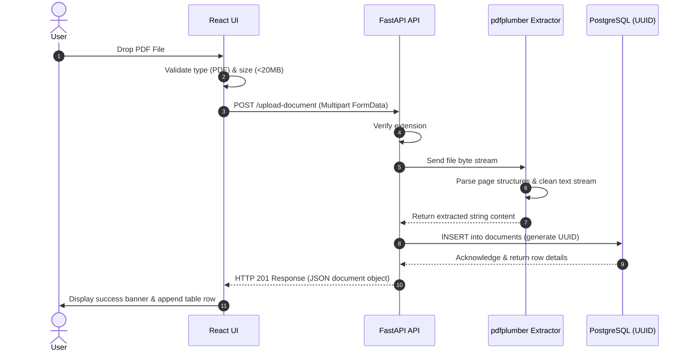
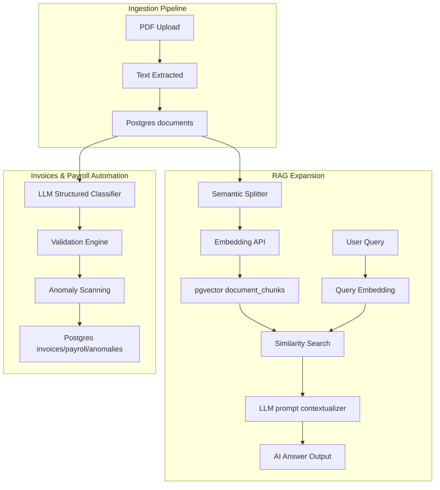
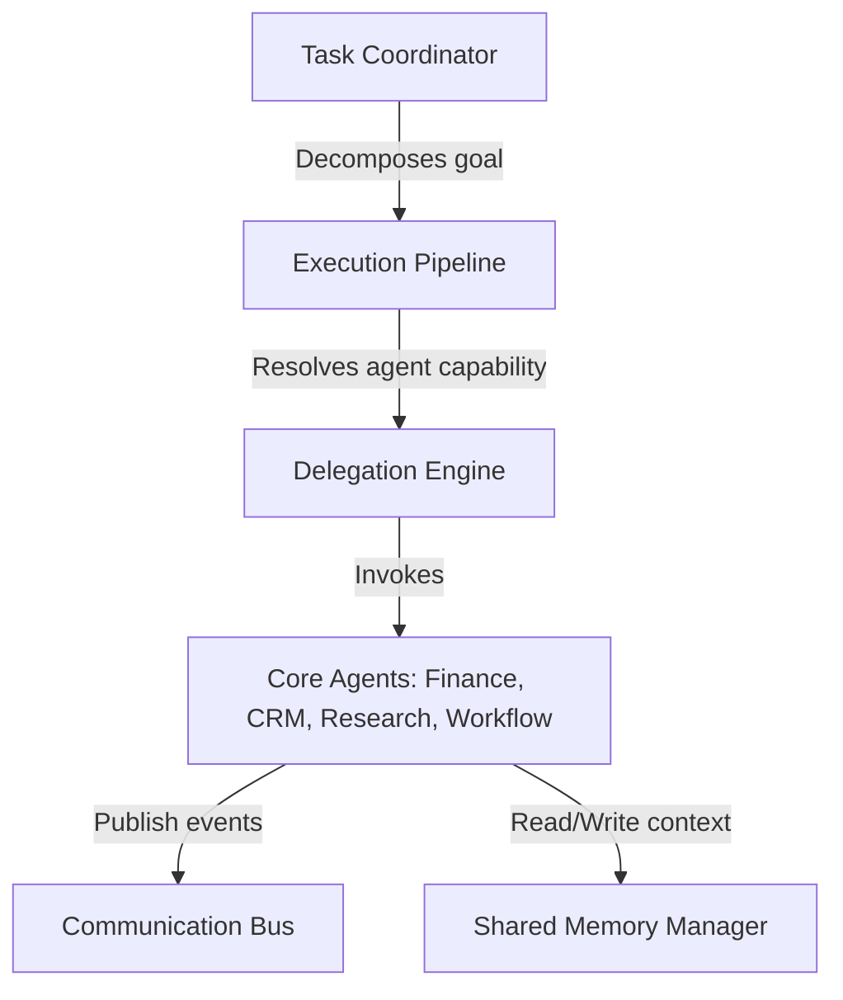
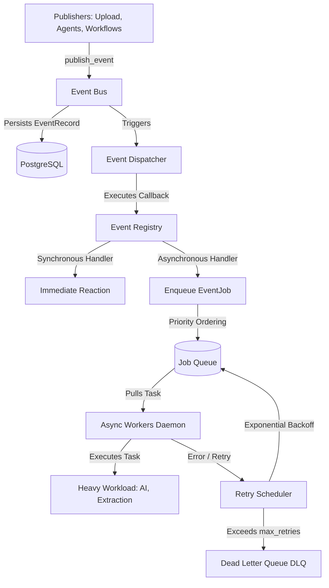
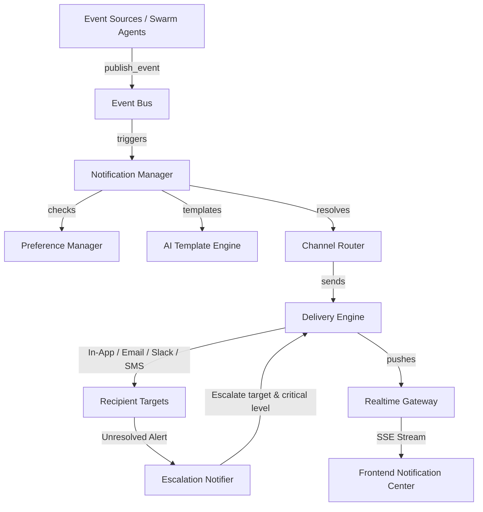
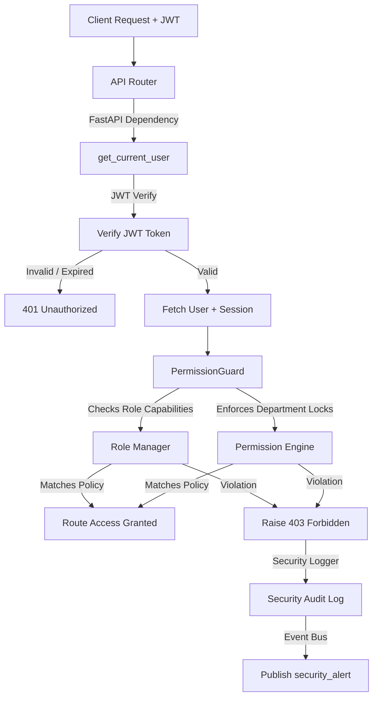

# System Architecture & Design Specification

This document provides a deep dive into IngestEngine's design patterns, layer configurations, and structural RAG evolution paths.

---

## 1. High-Level Data Flow

The following diagram illustrates how a file moves from drag-and-drop to text persistence:

---

## 2. Layer Architecture

### 2.1 Client Layer (Frontend SPA)
The client interface is structured around single-responsibility React components:
- **`FileUpload.tsx`**: State machine managing the dragging state, file format confirmation, payload size gating, and HTTP progress visual indicators.
- **`DocumentList.tsx`**: High-performance grid presenting system statistics and listing processed items.
- **`DocumentViewer.tsx`**: Text rendering drawer. Displays metrics like character and word count alongside raw copy commands.
- **`Dashboard.tsx` (Finance Operations)**: Control panel managing financial stats, transactional list grids, and Operational Risk compliance alerts.

### 2.2 API Layer (Backend)
- **FastAPI Framework**: Handles routing, asynchronous request handlers, and automatic validation schema generation.
- **Validation**: Enforced via Pydantic model configurations (see `schemas.py`) and programmatic math checking (see `validator.py`).
- **Invoice & Payroll Modules**: Custom services under `/modules/invoice_automation/` executing compliance validations, duplicate detections, and anomaly triggers on PostgreSQL data.
- **Processing Engine**: The text extraction process is isolated within `pdf_processor.py`, running in-memory without disk writes for increased speed and filesystem isolation.

### 2.3 Database Layer (Storage)
- **Engine**: PostgreSQL with pgvector extension enabled.
- **Container**: Runs on local Docker container (`local-postgres` mapping port `5433 -> 5432`).
- **Index Optimization**: Created `idx_documents_created_at` index on the `created_at` field, and HNSW indexes on chunk embeddings for cosine distance search.
- **Identities**: UUIDv4 keys are generated at the SQL database layer to avoid conflicts during future data syncs or vector shard divisions.

---

## 3. RAG + Vector DB Integration

The project employs a fully operational Retrieval-Augmented Generation context:

### Key Integration Steps
1. **Vector DB Integration**: Enabling the `vector` extension inside the PostgreSQL server.
2. **Text Chunking**: Slices raw document content into 600-character windows with 150-character sentence-boundary overlaps.
3. **Embeddings Pipeline**: Generates 1536-dimensional vectors for text chunks via OpenAI or a local mock vector fallback.
4. **Auditing Sync**: Intercepts ingested text to parse invoice or payroll models, run calculations validation, and register active compliance anomalies.

---

## 4. Multi-Agent AI Operations Swarm

The swarm architecture allows specialized autonomous agents to coordinate and resolve complex workflows:

### Components:
* **Registry & Coordination**: The Task Coordinator maps goal statements to capabilities.
* **Shared Memory & Context**: Agents communicate asynchronously by writing capability summaries to the database-backed shared memory layer.
* **Pub/Sub Logging**: All message exchanges are routed through the Communication Bus to persist trace histories for live developer auditing.

---

## 5. Real-Time Event Bus & Asynchronous Job Processing

Syntra OS integrates a distributed-ready, event-driven infrastructure enabling decoupled module communication and resilient asynchronous background task execution.

### Components
* **Central Event Bus**: Collects events, correlates them with trace contexts, publishes telemetry metrics, and persists them database-wide.
* **Registry & Dispatcher**: Manages module event subscriptions and coordinates reactions.
* **Priority Job Queue**: Supports atomic task reservation (avoiding worker race conditions) and processes critical operations before standard tasks.
* **Retry Engine & DLQ**: Ensures robustness by retrying failed tasks with exponential backoff delays, and moves terminally failed processes to a quarantined review container.
* **SSE Telemetry Streaming**: Live updates the frontend operations dashboard using Server-Sent Events (SSE).

---

## 6. Enterprise Notification & Communication Hub

Syntra OS incorporates an intelligent communication layer that handles multi-channel alerts routing, user preferences matching, incident escalations, and AI summarizations.

### Components
* **Notification Manager**: Orchestrator that binds events, triggers templating, computes channels, executes deliveries, and manages state updates.
* **Preference Manager**: Evaluates routing filters, channel settings, and module subscriptions for recipients.
* **AI Template Engine**: Integrates with LLMs to summarize raw system JSON payloads into beginner-friendly sentences.
* **Channel Router & Delivery Engine**: Route notifications across multiple simulated channels (In-app, SMTP Email, Slack webhooks, Twilio SMS) and log confirmation latency traces.
* **Escalation Notifier**: Raises unresolved notifications to `critical` priority and re-routes to secondary management stakeholders.
* **Realtime Gateway**: Implements SSE streams `/api/v1/notifications/stream` for live updates on the client UI.

---

## 7. Enterprise Authentication & Role-Based Access Control (RBAC) System

Syntra OS enforces security compliance and operational boundaries via a custom Identity & Access Management (IAM) engine.

### Components
* **Cryptographic Engine**: Secures user credential storage using standard PBKDF2 hashing, and signs access tokens using an in-house HS256 JWT builder.
* **Session Lifecycle Manager**: Manages session state persistence, tracks token expiration bounds, and implements global token invalidations.
* **Role Capability Engine**: Houses mapping matrices associating roles (e.g. `admin`, `finance_manager`, `sales_rep`, `compliance_officer`) with granular permissions (e.g. `invoices:read`, `crm_records:write`, `anomaly_overrides:execute`).
* **Boundary Permission Engine**: Enforces strict departmental partitions (e.g., `sales`, `finance`, `compliance`) preventing cross-department access except for global roles.
* **FastAPI Security Guards**: Decorates api routes with dependency-injected filters that authorize operations and raise structured errors.
* **Security Audit Logger**: Traces all authentication occurrences to database logs and routes security violations to the Event Bus, triggering immediate administrator alerts.

